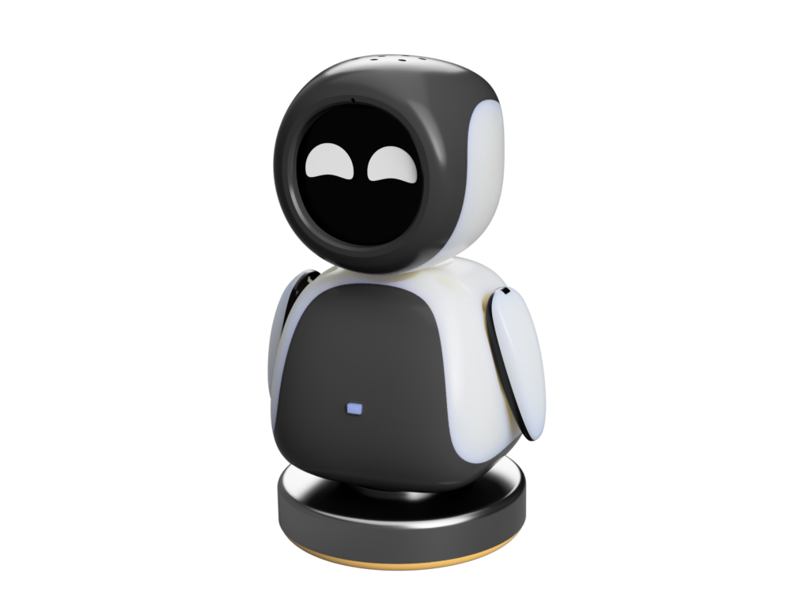

# electronBot

electronBot 是一个开源的可自行制作的机器人，它有着可爱的外形和丰富的功能，非常适合作为教育工具和个人创客项目。本网站专注于分享基于 ESP32 IDF 开发的 AI 增强版 electronBot 机器人。

## 什么是 ESP32+AI electronBot 机器人？

electronBot 是稚晖君开源的一个桌面级小机器工具人，外观设计的灵感来源是 WALL-E 里面的 EVE~机器人具备 USB 通信显示画面功能，具备 6 个自由度（手部 roll、pitch，颈部，腰部各一个），使用自己修改的特制舵机支持关节角度回传。
而我们的 ESP32 版本为其注入了更强大的 AI 能力。

### 小智已实现功能

- **多种联网方式**：支持 Wi-Fi 和 ML307 Cat.1 4G 连接
- **智能交互**：BOOT 键唤醒和打断，支持点击和长按两种触发方式
- **离线语音唤醒**：使用 ESP-SR 技术，无需联网即可唤醒
- **流式语音对话**：支持 WebSocket 或 UDP 协议的实时对话
- **多语言识别**：支持国语、粤语、英语、日语、韩语五种语言（SenseVoice）
- **声纹识别**：可识别是谁在呼叫 AI（3D Speaker 技术）
- **高质量语音合成**：集成火山引擎或 CosyVoice 的大模型 TTS
- **AI 大脑**：接入 Qwen、DeepSeek、Doubao 等大型语言模型
- **个性化定制**：可配置的提示词和音色，创建自定义角色
- **记忆功能**：具备短期记忆，每轮对话后自我总结
- **视觉显示**：支持 OLED/LCD 显示屏，可显示信号强弱或对话内容
- **表情系统**：LCD 能显示丰富表情图片
- **多语言界面**：支持中文、英文等多种语言

### 动作

| 动作类型      | 编号 | 描述            |
| ------------- | ---- | --------------- |
| Walk          | 1    | 行走            |
| Turn          | 2    | 转向            |
| Jump          | 3    | 跳跃            |
| Swing         | 4    | 摇摆            |
| Moonwalk      | 5    | 太空步          |
| Bend          | 6    | 弯曲            |
| ShakeLeg      | 7    | 抖腿            |
| UpDown        | 8    | 上下运动        |
| TiptoeSwing   | 9    | 脚尖摇摆        |
| Jitter        | 10   | 抖动            |
| AscendingTurn | 11   | 上升转弯        |
| Crusaito      | 12   | 十字步/混合步态 |
| Flapping      | 13   | 拍打动作        |

### 动作控制

每个动作执行完成后，机器人会自动回到初始位置(home)，以便于执行下一个动作。

### 唤醒方式：

使用唤醒词 **“你好小智”** 唤醒机器人。唤醒词可在编译源码时修改。

### 指令示例：

- **基本控制**：

  - “调高音量”
  - “调亮屏幕”
  - “切换主题暗黑模式/明亮模式”

- **动作控制**：

  - “举起手”
  - “跳个舞吧”
  - “旋转身体”
  - “随机做几个动作”
  - “停下来吧”

- **娱乐互动**：
  - “唱个歌吧”
  - “换个悲伤的表情”

### 温馨提示：

- 当机器人在执行动作时，仍可接收语音指令。
- 若背景噪音较大，需提高说话音量以确保指令识别。
- 动作指令实际由小智后台创建并下发任务执行。

## 本站内容

在本网站，你可以找到：

- **完整教程**：从零开始制作自己的 ESP32 AI 版 electronBot 机器人
- **零部件清单**：所有需要的电子元件和材料
- **组装指南**：详细的步骤图解
- **固件指南**：ESP32 编程和 AI 集成教程
- **问题解答**：常见问题的解决方案

## 开始制作

准备好制作你自己的智能 electronBot 机器人了吗？点击下面的链接开始你的 AI 机器人制作之旅！

  

    

      

        

          <h3>零基础入门</h3>
        

        

          

            从零开始，了解所需材料和基础知识。
          

        

        

          <a href="/docs/getting-started" class="button button--primary button--block">查看入门指南</a>
        

      

    

    

      

        

          <h3>材料准备</h3>
        

        

          

            查看完整的零部件清单和购买建议。
          

        

        

          <a href="/docs/bom" class="button button--primary button--block">查看零部件清单</a>
        

      

    

  

